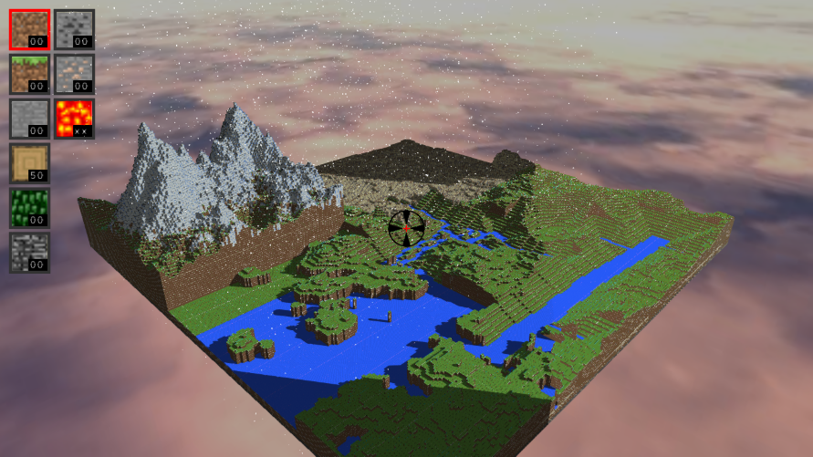
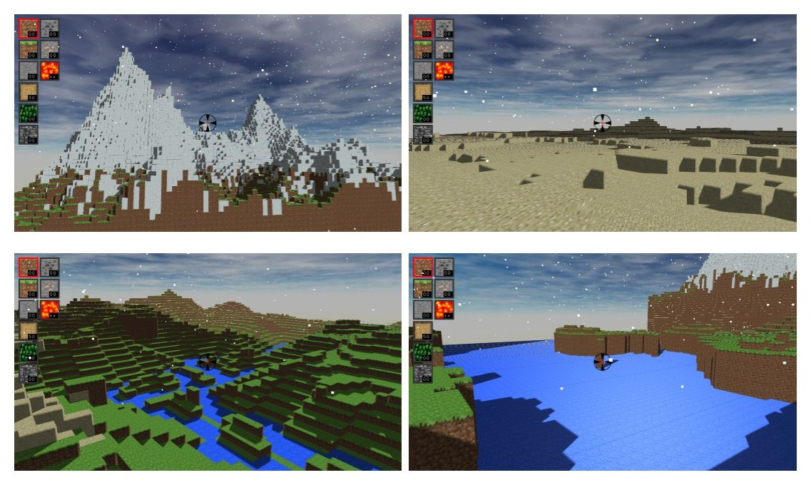
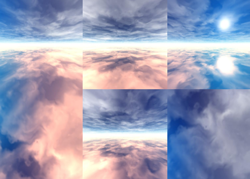
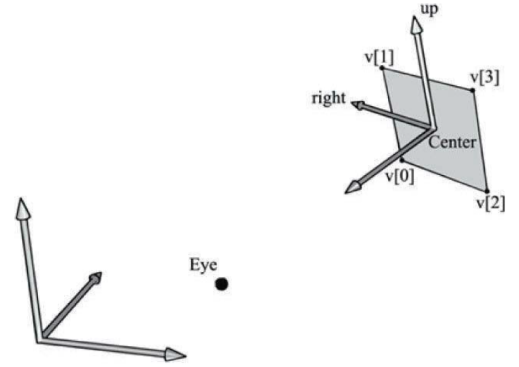
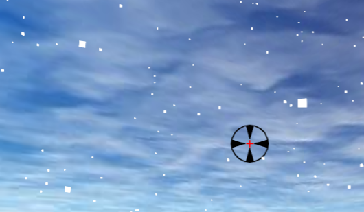
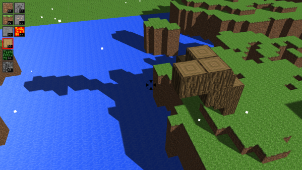
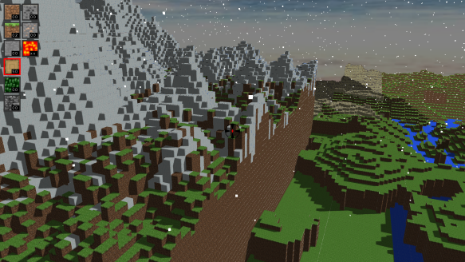
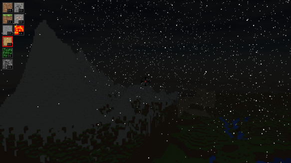
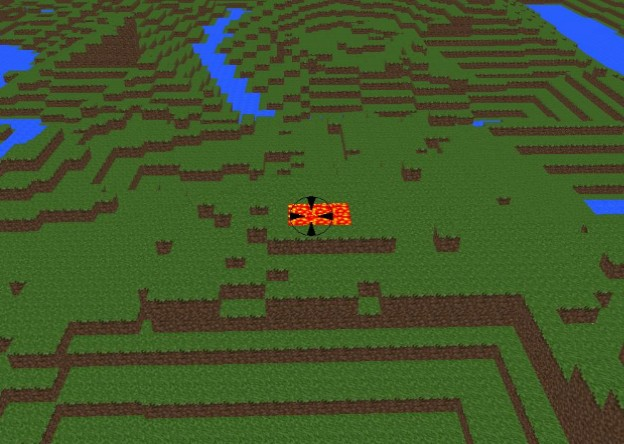
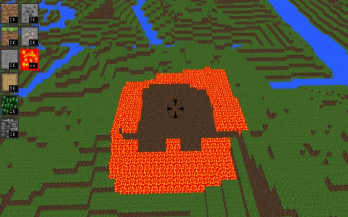

# Mini Minecraft

## Screenshots

## Features

We implemented lots of features:

* Perlin Noise Terrain
* Perlin Worm Caves
* Biomes
* Chunk Terrain Rendering
* Terrain Collisions and Physics
* Texture Animation(Water and Lava)
* L-System River
* Skybox(Cube Map)
* Snowy Weather(Particle System)
* Shadow Mapping
* Day & Night Cycle
* Fire
* Inventory GUI

### Biomes

Get different biomes by simply changing the parameters of our perlin noise function.

### Skybox

We used cube map provided by OpenGL to implement the skybox effect.

### Snowy Weather

We used geometry shader to simulate the snow billboard.

### Shadow Mapping

We applied bias to eliminate the shadow acne.

### Day & Night Cycle

Change the light intensity, direction as well as the color of the skybox to simulate day & night cycle.

### Fire Spreading and Breaking

